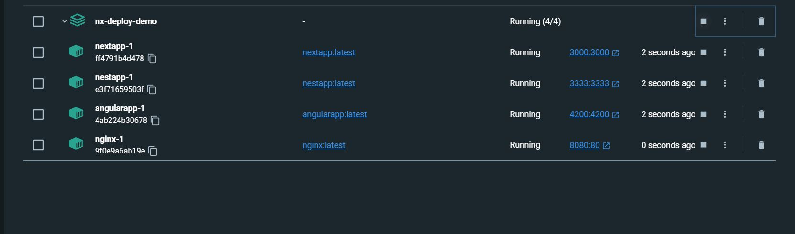

# NxDeployDemo

NX Deployment Demo for Client and Server

- Angular (http://localhost:4200)
- Nextjs (http://localhost:3000)
- Nestjs (http://localhost:3333)
- Nginx (http://localhost:8080)

## Tech Stack

- [x] Nestjs
- [x] Nextjs
- [x] Angular
- [x] Docker
- [x] Docker-Compose
- [x] Nginx
- [x] Kubernetes [TODO]



```javascript
## Create nx workspace
$ npx create-nx-workspace@latest --packageManager=yarn

## choose next

## nestjs
$ yarn add -D @nrwl/nest
$ nx g @nrwl/nest:app nestapp

## angular
$ yarn add -D @nrwl/angular
nx g @nrwl/angular:app angularapp

##zsh
$ sudo apt update
$ sudo apt upgrade
$ sudo apt install zsh -y

## versioning
$ yarn add -D standard-version

## build all projects
# build all projects
$ yarn build

# docker build all projects
$ yarn docker-build

# docker run all projects
$ yarn docker-run

# docker-compose run
$ docker-compose up
```

<a alt="Nx logo" href="https://nx.dev" target="_blank" rel="noreferrer"></a>

✨ **This workspace has been generated by [Nx, a Smart, fast and extensible build system.](https://nx.dev)** ✨

## Development server

Run `nx serve nextapp` for a dev server. Navigate to http://localhost:4200/. The app will automatically reload if you change any of the source files.

## Understand this workspace

Run `nx graph` to see a diagram of the dependencies of the projects.

## Remote caching

Run `npx nx connect-to-nx-cloud` to enable [remote caching](https://nx.app) and make CI faster.

## Further help

Visit the [Nx Documentation](https://nx.dev) to learn more.
